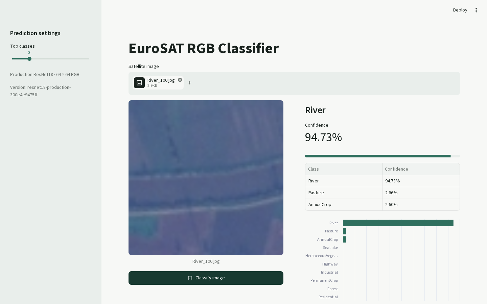
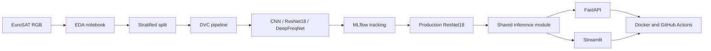
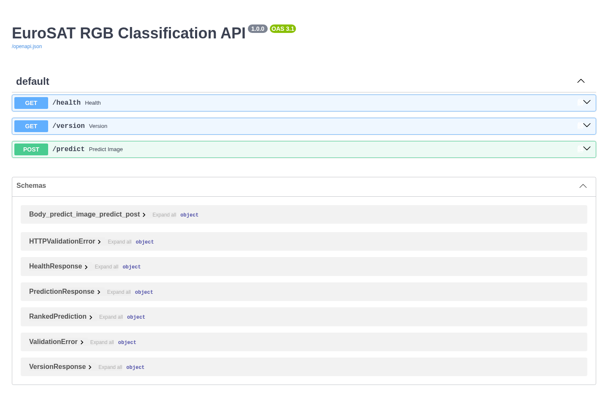
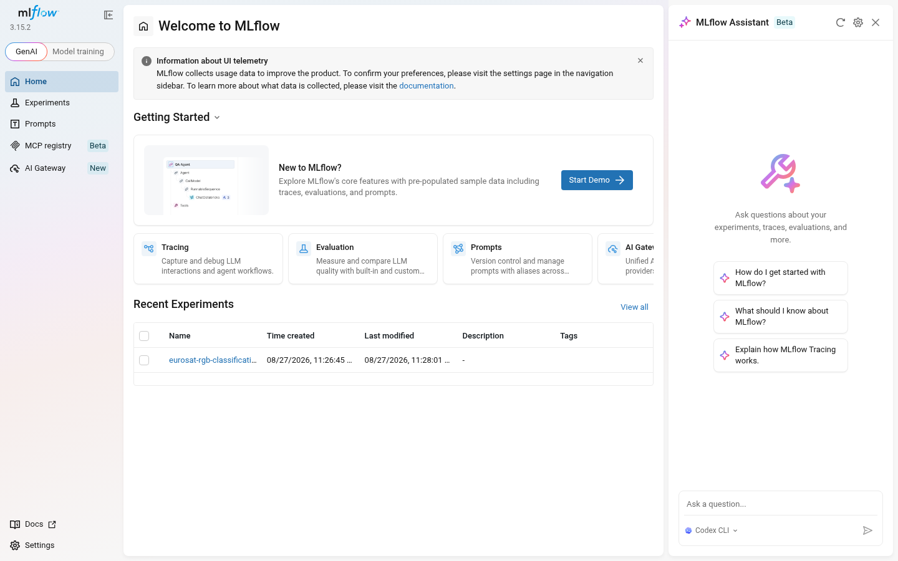
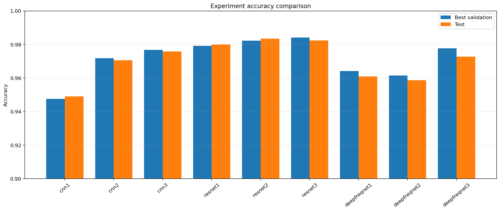

# EuroSAT RGB Classification MLOps

[](https://github.com/Nanalert/eurosat-multispectral-classification-mlops/actions/workflows/ci.yml)
[](https://github.com/Nanalert/eurosat-multispectral-classification-mlops/actions/workflows/containers.yml)

An end-to-end PyTorch project for classifying 64 x 64 RGB satellite images
from EuroSAT into ten land-use and land-cover classes. The repository covers
exploratory analysis, stratified data splitting, three model families, MLflow
experiment tracking, DVC pipelines, production inference, FastAPI, Streamlit,
automated tests, Docker, and GitHub Actions.



## Highlights

- 27,000 RGB images across ten EuroSAT classes
- Stratified 70% training, 15% validation, and 15% test split
- SmallCNN, pretrained ResNet18, and DeepFreqNet experiments
- Production ResNet18 with 98.64% held-out test accuracy
- Shared, checksum-verified inference code for API and UI
- FastAPI endpoint and responsive Streamlit application
- MLflow tracking and a parameterized DVC training pipeline
- Pytest coverage gate, Ruff, Docker builds, and protected GitHub checks

## Production Result

| Metric | Result |
| --- | ---: |
| Test accuracy | 98.64% |
| Macro precision | 98.57% |
| Macro recall | 98.59% |
| Macro F1 | 98.58% |
| Test images | 4,050 |
| Mean CPU inference time | 3.49 ms/image |

The benchmark used 20 measured runs after three warm-up runs on the local CPU;
latency will vary by hardware. See [the complete experimental results](docs/results.md)
for model comparisons, class metrics, training curves, and confusion matrices.

## Architecture



## Dataset

This project uses the EuroSAT dataset created by Patrick Helber, Benjamin
Bischke, Andreas Dengel, and Damian Borth. The RGB subset contains 27,000 JPG
images at 64 x 64 pixels.

| Split | Images | Proportion |
| --- | ---: | ---: |
| Training | 18,900 | 70% |
| Validation | 4,050 | 15% |
| Test | 4,050 | 15% |

The ten classes are `AnnualCrop`, `Forest`, `HerbaceousVegetation`, `Highway`,
`Industrial`, `Pasture`, `PermanentCrop`, `Residential`, `River`, and `SeaLake`.
The split uses seed `42` and preserves class proportions in every subset.

- Dataset DOI: <https://doi.org/10.5281/zenodo.7711810>
- License: EuroSAT is distributed under the MIT License.
- Attribution: Contains modified Copernicus Sentinel data.

## Quick Start

### Prerequisites

- Git
- Python 3.10
- Docker with Docker Compose, for the container workflow
- About 100 MB for the RGB dataset and 45 MB for the model checkpoint

### Clone and install

```bash
git clone https://github.com/Nanalert/eurosat-multispectral-classification-mlops.git
cd eurosat-multispectral-classification-mlops
python3 -m venv .venv
source .venv/bin/activate
python -m pip install --upgrade pip
python -m pip install -r requirements.txt
```

### Download the production model

The checkpoint and its metadata are published in the
[`production-model-v1` GitHub Release](https://github.com/Nanalert/eurosat-multispectral-classification-mlops/releases/tag/production-model-v1).

```bash
mkdir -p models/production
curl -L -o models/production/resnet18-production.pt \
  https://github.com/Nanalert/eurosat-multispectral-classification-mlops/releases/download/production-model-v1/resnet18-production.pt
curl -L -o models/production/resnet18-production_metadata.json \
  https://github.com/Nanalert/eurosat-multispectral-classification-mlops/releases/download/production-model-v1/resnet18-production_metadata.json
python python_script/verify_production_artifacts.py
```

The verification script checks both files against the SHA-256 values used by
CI and the Docker workflow.

## Run the Application

### Docker Compose

After downloading the production model:

```bash
docker compose up --build -d
docker compose ps
```

Open the Streamlit interface at <http://127.0.0.1:8501> and the FastAPI
documentation at <http://127.0.0.1:8000/docs>. Stop both services with:

```bash
docker compose down
```

The containers run as non-root users with read-only root filesystems. More
container commands are available in [docker/README.md](docker/README.md).

### Run without Docker

Open two terminals with the virtual environment active:

```bash
uvicorn app.api:app --host 127.0.0.1 --port 8000
```

```bash
streamlit run app/streamlit_app.py \
  --server.address 127.0.0.1 --server.port 8501
```

## API Usage



Health and model metadata:

```bash
curl http://127.0.0.1:8000/health
curl http://127.0.0.1:8000/version
```

Classify an image and return the top three classes:

```bash
curl -X POST "http://127.0.0.1:8000/predict?top_k=3" \
  -H "accept: application/json" \
  -F "image=@tests/fixtures/River_100.jpg;type=image/jpeg"
```

The API accepts readable image uploads up to 10 MB. JPG, PNG, WebP, and TIFF
files are supported by the underlying Pillow decoder. Every image is converted
to RGB, resized to 64 x 64, and normalized with ImageNet mean and standard
deviation before inference.

## Data Preparation and Training

Download and extract the EuroSAT RGB `2750` directory from the dataset DOI to:

```text
data/raw/EuroSAT_RGB/2750/
```

The directory must contain the ten class folders listed above. Then generate
the deterministic split:

```bash
dvc repro split
```

The tracked DVC files describe the dataset and pipeline, but this repository
does not expose the owner's local DVC cache. A new clone must download EuroSAT
from Zenodo before reproducing data or training.

Start the local MLflow server in one terminal:

```bash
mlflow server \
  --backend-store-uri sqlite:///mlflow.db \
  --default-artifact-root ./mlartifacts \
  --host 127.0.0.1 --port 5000
```

Open <http://127.0.0.1:5000>, then reproduce the production training stage:



```bash
dvc repro train
```

Training uses the values in [params.yaml](params.yaml). It updates weights only
from the training split, selects the best checkpoint with validation accuracy,
and evaluates the test split only after training. This stage can take substantial
time and will replace local production outputs.

## Evaluation

The production model is an ImageNet-pretrained ResNet18 with a ten-output
classification head. Training uses random horizontal and vertical flips,
random 90-degree rotations, cross-entropy loss, Adam at learning rate `0.0001`,
and ImageNet normalization.



The production evaluation saves epoch metrics, per-class precision/recall/F1,
predictions, confusion matrices, plots, and complete training metadata. The
published checkpoint is not stored in Git; CI downloads it from the release and
verifies its checksum.

## Testing and Quality

Download the production model first, then run the same local checks used by CI:

```bash
ruff check app python_script tests
ruff format --check app python_script tests
pytest --cov=python_script.inference --cov=app --cov-branch \
  --cov-report=term-missing --cov-fail-under=90
dvc dag
```

GitHub requires five checks on `main`: Ruff, Pytest, DVC validation, the API
Docker build, and the Streamlit Docker build. Container images are published to
GitHub Container Registry after successful pushes to `main`.

## Project Structure

```text
app/                 FastAPI and Streamlit applications
data/                DVC pointers and generated split CSV files
docker/              Production container definitions
docs/                Curated results and documentation images
models/production/   Local production outputs; checkpoint comes from a release
python_script/       Splitting, training, evaluation, tracking, and inference
tests/               API, inference, Streamlit, Docker, and artifact tests
EDA.ipynb            Dataset exploration and quality analysis
dvc.yaml             Reproducible split and production-training stages
params.yaml          Data, training, and MLflow parameters
compose.yaml         Local API and Streamlit deployment
```

## Limitations

- The production model uses only EuroSAT RGB images, not the 13-band dataset.
- Predictions are restricted to the ten EuroSAT classes.
- Performance on other satellites, resolutions, seasons, or geographic regions
  has not been established.
- Production data-drift monitoring is not implemented.
- No public cloud deployment is maintained because it would create ongoing
  personal infrastructure costs; the tested Docker images remain deployable.
- The CPU benchmark describes one local machine and is not a service-level target.

## Documentation

- [Detailed experiment results](docs/results.md)
- [Docker operations](docker/README.md)
- [Continuous integration](docs/ci.md)
- [Production model release](https://github.com/Nanalert/eurosat-multispectral-classification-mlops/releases/tag/production-model-v1)

## License and Citation

No separate license has been declared for this repository's source code. The
EuroSAT dataset is distributed under the MIT License. When using the dataset,
follow its license and cite the original EuroSAT publication and dataset record:

```text
Helber, P., Bischke, B., Dengel, A., & Borth, D.
EuroSAT: A Novel Dataset and Deep Learning Benchmark for Land Use and
Land Cover Classification. IEEE Journal of Selected Topics in Applied
Earth Observations and Remote Sensing, 2019.
Dataset: https://doi.org/10.5281/zenodo.7711810
```
