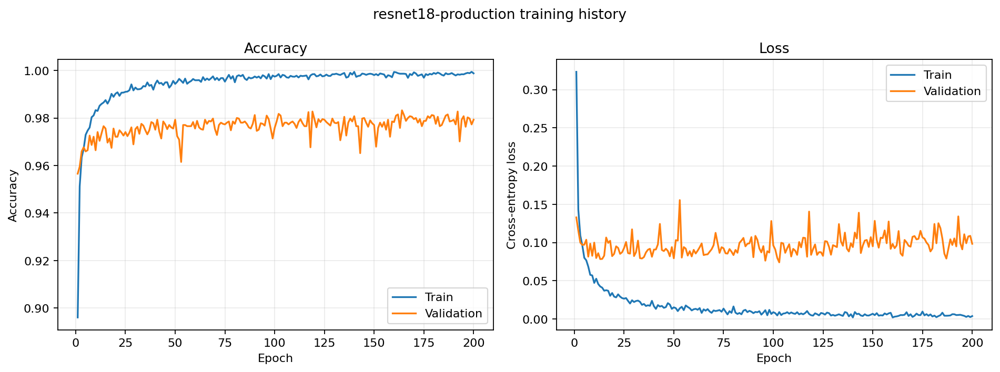
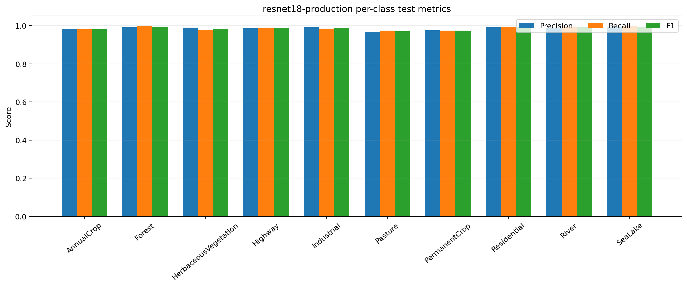
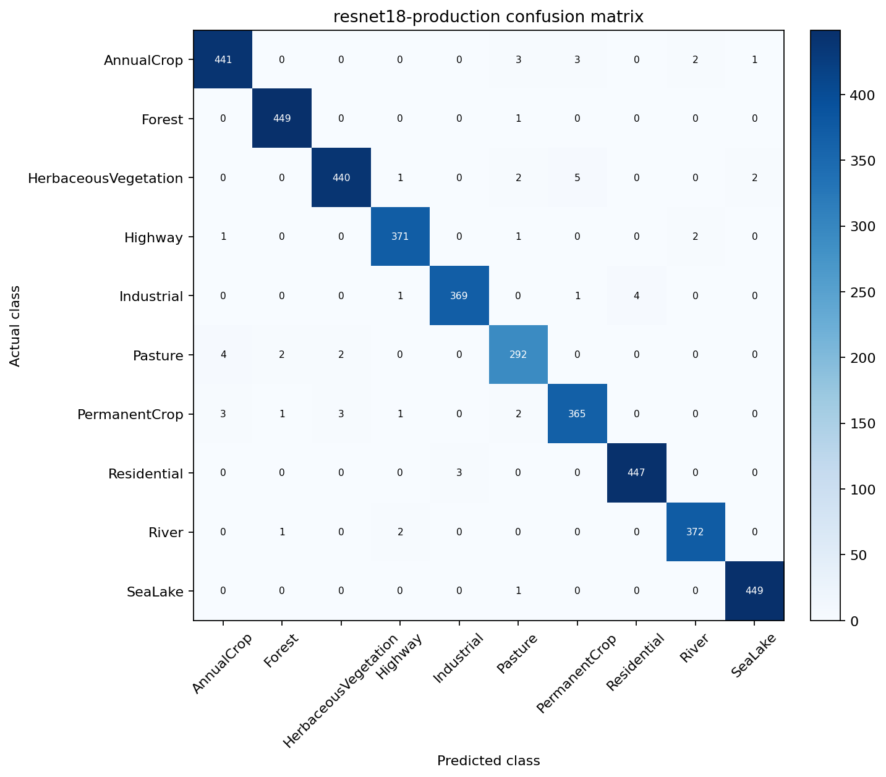
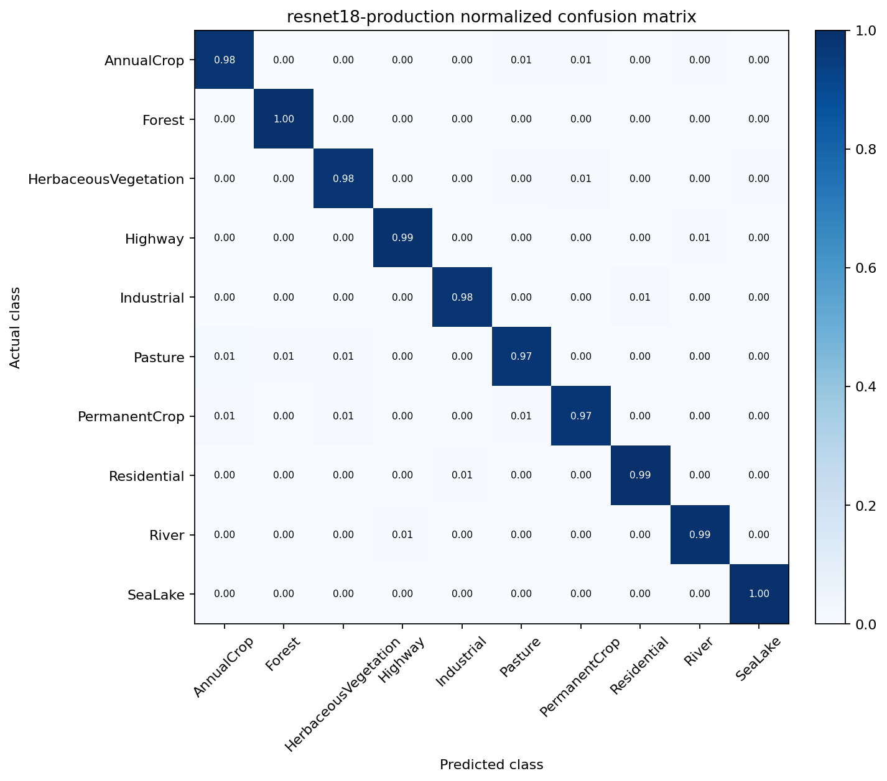
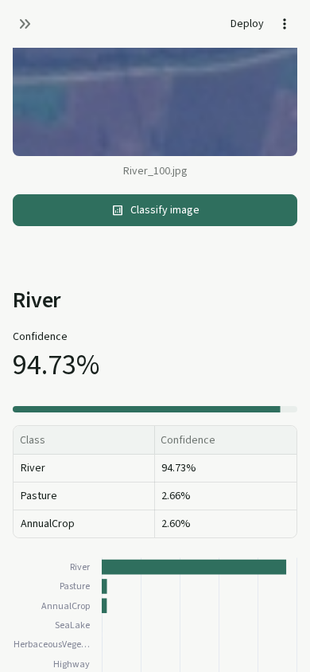

# Experimental Results

This page records the comparable RGB classification experiments and the final
production evaluation. Every reported test metric uses the held-out 15% test
split containing 4,050 images. Training and model selection use only the
training and validation splits.

## Dataset Protocol

| Property | Value |
| --- | --- |
| Dataset | EuroSAT RGB |
| Images | 27,000 JPG images |
| Input | 64 x 64 RGB |
| Classes | 10 |
| Split | 70% train / 15% validation / 15% test |
| Split seed | 42 |
| Training augmentation | Horizontal/vertical flips and 90-degree rotations |
| Production normalization | ImageNet mean and standard deviation |

The training split contains 18,900 images. Validation and test each contain
4,050 images. Stratification preserves the original per-class proportions.

## Architecture Comparison

| Run | Architecture | Completed epochs | Best epoch | Best validation accuracy | Test accuracy | Macro F1 |
| --- | --- | ---: | ---: | ---: | ---: | ---: |
| cnn1 | SmallCNN | 48 | 38 | 94.77% | 94.91% | 94.77% |
| cnn2 | SmallCNN | 200 | 194 | 97.19% | 97.06% | 97.01% |
| cnn3 | SmallCNN | 325 | 275 | 97.68% | 97.58% | 97.55% |
| resnet1 | ResNet18 | 35 | 25 | 97.93% | 98.00% | 97.94% |
| resnet2 | ResNet18 | 165 | 115 | 98.22% | 98.35% | 98.28% |
| resnet3 | ResNet18 | 500 | 467 | 98.42% | 98.25% | 98.18% |
| deepfreqnet1 | DeepFreqNet | 50 | 48 | 96.42% | 96.10% | 96.02% |
| deepfreqnet2 | DeepFreqNet | 50 | 40 | 96.15% | 95.88% | 95.73% |
| deepfreqnet3 | DeepFreqNet | 500 | 443 | 97.78% | 97.28% | 97.23% |
| **resnet18-production** | **ResNet18** | **200** | **164** | **98.32%** | **98.64%** | **98.58%** |

The production ResNet18 is the selected model because it has the highest test
accuracy and macro F1 while retaining the established pretrained ResNet18
inference path. Extending a run to 500 epochs did not improve held-out accuracy,
so epoch count alone was not a useful selection criterion.

## Production Configuration

| Setting | Value |
| --- | --- |
| Architecture | ImageNet-pretrained ResNet18 |
| Parameters | 11,181,642 trainable parameters |
| Loss | CrossEntropyLoss |
| Optimizer | Adam |
| Learning rate | 0.0001 |
| Batch size | 64 |
| Configured epochs | 200 |
| Early stopping | Enabled, patience 50 |
| Selection metric | Validation accuracy |
| Best epoch | 164 |
| Normalization mean | 0.485, 0.456, 0.406 |
| Normalization standard deviation | 0.229, 0.224, 0.225 |

## Production Test Metrics

| Metric | Value |
| --- | ---: |
| Test loss | 0.0639 |
| Test accuracy | 98.64% |
| Macro precision | 98.57% |
| Macro recall | 98.59% |
| Macro F1 | 98.58% |

### Per-Class Metrics

| Class | Precision | Recall | F1 | Support |
| --- | ---: | ---: | ---: | ---: |
| AnnualCrop | 98.22% | 98.00% | 98.11% | 450 |
| Forest | 99.12% | 99.78% | 99.45% | 450 |
| HerbaceousVegetation | 98.88% | 97.78% | 98.32% | 450 |
| Highway | 98.67% | 98.93% | 98.80% | 375 |
| Industrial | 99.19% | 98.40% | 98.80% | 375 |
| Pasture | 96.69% | 97.33% | 97.01% | 300 |
| PermanentCrop | 97.59% | 97.33% | 97.46% | 375 |
| Residential | 99.11% | 99.33% | 99.22% | 450 |
| River | 98.94% | 99.20% | 99.07% | 375 |
| SeaLake | 99.34% | 99.78% | 99.56% | 450 |

Pasture has the lowest F1, followed by PermanentCrop. The largest individual
off-diagonal count is five HerbaceousVegetation images predicted as
PermanentCrop. Pasture and Forest share visual texture in some examples, but
the final test matrix contains only three errors between those two classes, so
they are not the dominant production-model confusion pair.

## Confusion Matrices

| Counts | Row-normalized |
| --- | --- |
|  |  |

## Inference Benchmark

The shared predictor was benchmarked on CPU with three warm-up calls and 20
measured calls using one RGB test image.

| Metric | Value |
| --- | ---: |
| Mean | 3.49 ms/image |
| Median | 3.39 ms/image |
| Minimum | 2.35 ms/image |
| Maximum | 5.10 ms/image |
| Calculated throughput | 286.60 images/second |

These numbers measure single-process local model execution, not network request
latency or multi-user throughput. They should be rerun on each deployment target.

## User Interface Checks

The Streamlit application was tested in real Chromium sessions at desktop
1440 x 900 and mobile 390 x 844 viewports. Both checks confirmed a visible
prediction, no browser errors, and no horizontal overflow.

| Desktop | Mobile |
| --- | --- |
|  |  |

## Reproducibility Artifacts

- `models/production/resnet18-production_metadata.json`: full architecture,
  optimizer, loss, runtime, preprocessing, split, and result metadata
- `models/production/resnet18-production_metrics.csv`: epoch history
- `models/production/resnet18-production_class_metrics.csv`: class metrics
- `models/production/resnet18-production_test_predictions.csv`: predictions
- `models/production/resnet18-production_test_summary.json`: final summary
- `reports/experiment_comparison.csv`: cross-architecture comparison source
- `reports/inference_benchmark.json`: local timing source

Generated model outputs are local/DVC artifacts. The deployable checkpoint and
metadata are distributed through the
[`production-model-v1` release](https://github.com/Nanalert/eurosat-multispectral-classification-mlops/releases/tag/production-model-v1).

## Limitations

- The comparison applies to the recorded training settings; it is not an
  exhaustive hyperparameter search.
- The final test split was evaluated after model selection and should not be
  reused for future setting selection.
- Results cover EuroSAT RGB only, not its 13-band multispectral variant.
- The dataset represents a limited satellite source and geographic domain.
- Inference latency is hardware-specific and excludes API/network overhead.
